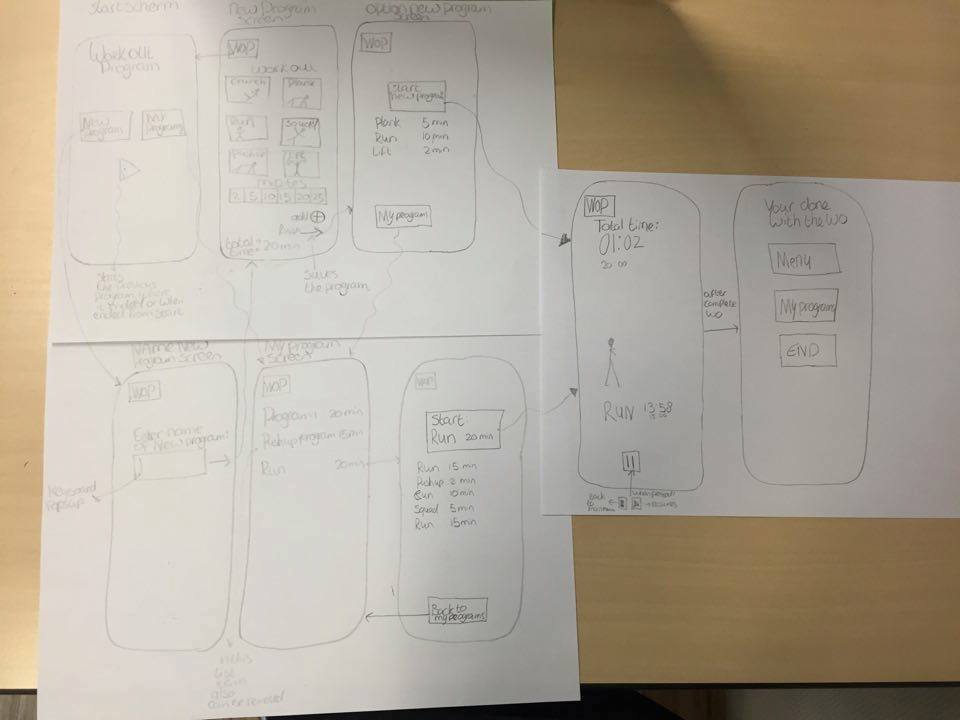
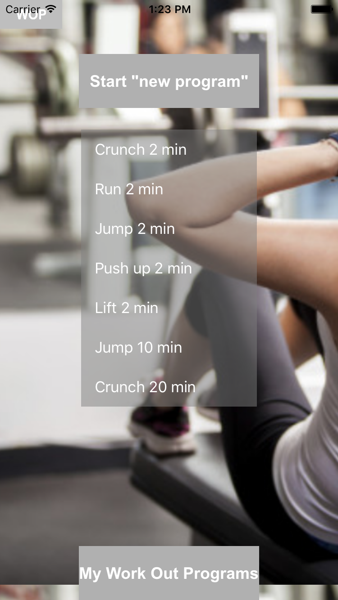
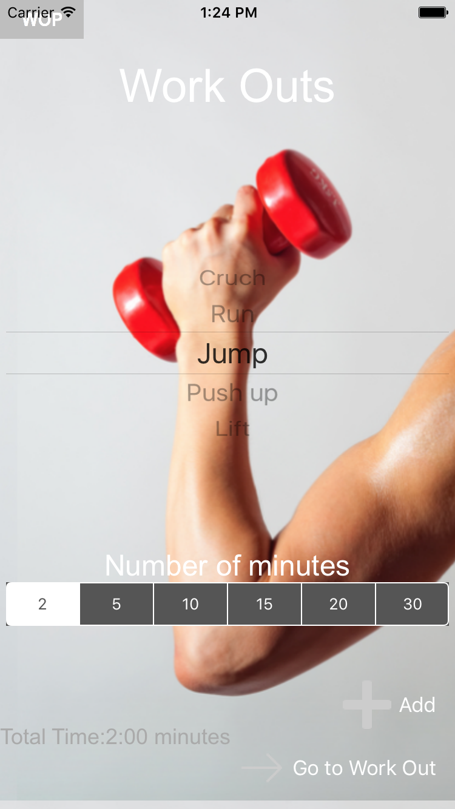

# Programmeer-Project

Nienke Pot  
Studentnummer: 10381015   
Project titel: Work Out Program

# Proposal

Het voorstel is om een work out program applicatie te maken. Deze applicatie geeft de gebruiker de mogelijkheid om eerst zelf een work out programma in te stellen en vervolgens kan de gebruiker dit programma gebruiken. Tijdens het sporten laat de applicatie zien welke oefeningen je moet doen en hoelang. Dit geeft de sporter een houvast tijdens het sporten. De sporter hoeft op deze manier niet na te denken tijdens het sporten.  

<b>Features</b> 
- De gebruiker kan zelf een work out programma opstellen. Dit kan door een van de work outs te kiezen en vervolgens te kiezen hoelang je dit wilt doen. 
- De Work outs worden opgeslagen in My Work Outs, zodat de gebruiker een work out opnieuw kan gebruiker. In My Work Outs kan de gebruiker ook een work out verwijderen. 
- Als je de applicatie opnieuw opstart, kan je verder gaan met de work out waar je gebleven was. 
- Tijdens de work out, wordt de activiteit getoond, de totale tijd van de work out en de tijd van specifieke activiteit. 
- De work out kan worden gepauzeerd, vervolgens kan de gebruiker de work out weer vervolgen of de work out volledig stoppen. 
- Aan het einde van de work out kan de gebruiker terug gaan naar het menu, terug gaan naar My Work Out gaan of de applicatie volledig afsluiten. 
 

<b>Schetsen</b> 

<b>Data sets and sources</b>  
 - Eerst was het idee om de data in een list op te slaan, maar vervolgens wilde ik gebruik maken van Cloudkit als database. Uiteindelijk heb ik gekozen voor een Sqlite database om de data in op te slaan. 

<b>Onderdelen van de applicatie</b> 
- New Work Out Program: hier wordt een nieuw work out programma vastgesteld, door op een work out te klikken, dan een tijd aan te klikken en dan toe te voegen. 
- Vervolgens wordt de nieuwe work out opgeslagen in My Work Outs. En vervolgens kan de gebuiker in My Work Out overview, een overzicht van de work out vinden.  
- De work out kan worden afgespeeld, gepauzeerd en worden gestopt. 

<b>Mogelijke problemen</b> 
- De database is een nieuw dus het kan zijn dat ik daar ergens tegen aan ga lopen. 
- Het verzenden van data tussen de schermen met NSUserDefaults. Want dit ging in het vorige project niet goed, dus nu moet ik goed gaan kijken hoe ik dat beter kan gaan aanpakken. 
- De grootte van de work out. 

<b>Eventuele toevoegingen</b> 
Mocht de applicatie te simpel blijken zijn er een aantal features die ik wil toevoegen:
- Geluid: tijdens de work out vertelt een stem, de nieuwe opdracht.
- De mogelijkheid om na een work out, de work out te ranken of iets dergelijks om aan te geven hoe zwaar het was.
- een optie om als gebruiker zelf een work out type toe te voegen. 
- Delen van de work out met anderen. 

<b>Review gelijkwaardige applicaties</b> 
- Seven: deze applicatie lijkt op deze app. De applicatie geeft aan de gebruiker aan wat hij moet doen en hoelang. De gebruiker kan kiezen tussen een aantal oefeningen, maar kan zelf niet een work out samenstellen. Een voice over geeft instructies aan de gebruiker.
-  Trainingen: deze applicatie helpt de gebruiker ook tijdens de training, maar richt zich maar op 1 spiergroep. De gebruiker kan hier ook niet zelf een volledige work out samenstellen. De applicatie laat wel instructie fimpjes zien, zodat de gebruiker deze makkelijk kan nadoen. 

# Cite

- Achtergrond: http://stackoverflow.com/questions/25106784/how-to-set-a-background-image-to-a-uiview-in-swift
- Timer: https://www.youtube.com/watch?v=g_bc4nSGuI4
- Timer format: http://rshankar.com/simple-stopwatch-app-in-swift/
- SQLite install manual: https://github.com/stephencelis/SQLite.swift/blob/master/Documentation/Index.md#cocoapods
- Segue met voorwaarde: http://jamesleist.com/ios-swift-tutorial-stop-segue-show-alert-text-box-empty/
- Dictionary en index: //http://stackoverflow.com/questions/24640990/how-do-i-get-the-key-at-a-specific-index-from-a-dictionary-in-swift
- Afspelen geluid: http://stackoverflow.com/questions/24393495/playing-a-sound-with-avaudioplayer
    https://www.hackingwithswift.com/example-code/media/how-to-play-sounds-using-avaudioplayer
- Minutesbar: http://www.ioscreator.com/tutorials/segmented-control-tutorial-ios8-swift
- Pickerview: http://www.ioscreator.com/tutorials/picker-view-tutorial-ios8-swift

