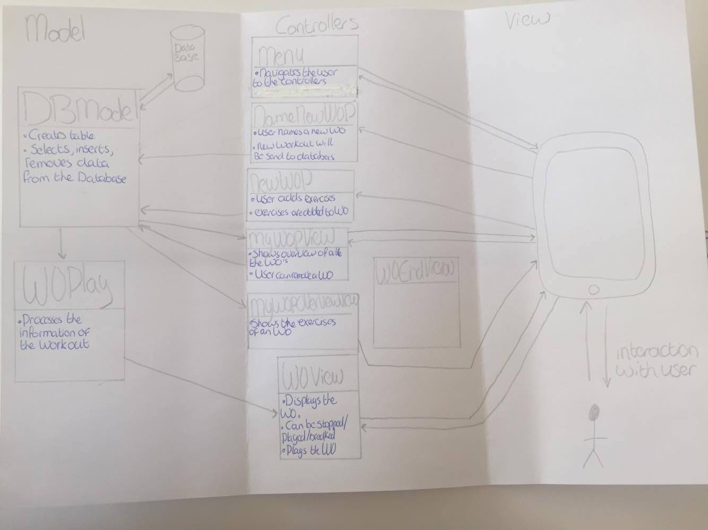

#Report

Nienke Pot  
Studentnummer: 10381015   
Project titel: Work Out Program

##Korte Omschrijving.

De Work Out Program applicatie geeft de gebruiker de mogelijkheid om zelf een work out samen te stellen en deze tijdens het sporten af te spelen. Op deze manier heeft de gebruiker een houvast tijdens het sporten en hoeft niet na te denken wat de volgende oefening wordt. 
De gebruiker kan zelf een programma maken door een oefening met een tijdsduur toe te voegen, totdat de work out compleet is. De gebruiker kan vervolgens uit een overzicht alle work outs zien en daaruit kiezen. Vervolgens krijgt de gebruiker een overzicht van de work out te zien en kan ervoor kiezen om een andere work out te bekijken of om deze te starten. Als de work out wordt afgespeeld, krijgt de gebruiker aan het einde van een oefening een geluid te horen en wordt de work out gepauzeerd. Vervolgens kan de gebruiker als hij klaar is voor het volgende oefening weer op play klikken. Als de work out klaar is kan de gebruiker naar het menu, een overzicht van de work outs gaan of de applicatie afsluiten.  

<b>Schetsen</b> 

##Design

###Framework Design

<b> Model</b> 
De applicatie maakt gebruik van een lokale Sqlite Database. 
De applicatie heeft twee models; DBModel en WOPlay. DBModel bevat alle functies die de lokale database betreffen. Dit model selecteert, inserts en verwijdert informatie van de database. Het WOPlay model verwerkt informatie verkregen van DBModel over de work out zodat de work out kan worden afgespeeld. De oefeningen met tijdsduur worden geselecteerd uit de database door DBModel en in een dictionary gestopt. WOplay leest deze dictionary vervolgens weer uit. 
<b> View en controllers</b> 
In het menu kan de gebruiker navigeren naar een nieuwe work out maken, het overzicht van de work outs zien of om meteen de vorige work out nog eens af te spelen. Dit kan alleen als er al iets in staat anders is deze optie verborgen. 
Bij het maken van een nieuwe work out kiest de gebruiker eerst een nieuwe naam voor de work out. Deze mag niet leeg zijn en moet ook uniek zijn. De gebruiker voert de naam in en NameNewWOP roept DBModel aan om een nieuwe work out aan te maken in de database. 
Vervolgens kan de gebruiker in NewWOP oefeningen toevoegen aan de work out. NewWOP roept vervolgens DBModel aan om dit toe te voegen in de database bij de nieuwe work out. 
In MYWOPView kan de gebruiker een overzicht zien van alle aangemaakte work outs. Ook kan de gebruiker een work out hier verwijderen. MYWOPView roept DBModel aan om de work outs uit de database te selecteren, om eventueel een work out te verwijderen. En als de gebruiker een work out wil zien in MYWOPOverviewView selecteert DBModel alle oefeningen van de work out. 
Als de gebruiker de work out start, dan wordt een voor een de oefening afgespeeld en de totate tijd van de work out. In WOPlay wordt de totale tijd van de work out uitgerekend en worden de oefeningen een voor een uit de dictionary gehaald. De dictionary met alle oefeningen van de work out wordt door DBModel uit de database geselecteerd. 

##Uitdagingen in het proces.
- Timer in viewcontroller, lange code niet in model
-SQLite, geen cloud kit
- lege wo en wo aanpassen, te kort tijd
- niet overzicht tijdens het toevoegen van exercises, niet mooi te veel op het scherm 
with brief arguments

 

